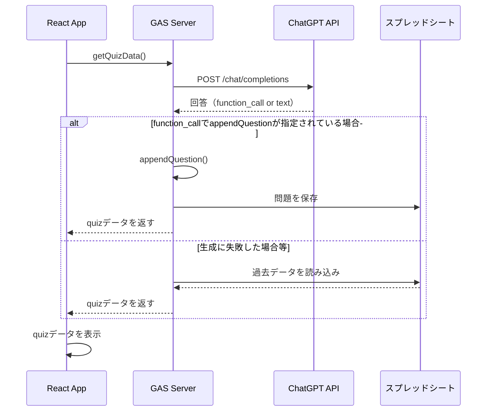

# ChatGPTのFunction Callingを活用したアプリケーション
問題をAIに考えてもらい表示するWebアプリケーションです


## 使用技術
- [React](https://ja.react.dev/)：フロントエンド
- [Vite](https://ja.vite.dev/)：React, TypeScriptのビルドツール
- [GoogleAppsScript](https://developers.google.com/apps-script?hl=ja)：サーバー替わり
- [OpenAI API](https://openai.com/ja-JP/api/)：OpenAIの提供するChatGPTが利用できるAPI
- [Google スプレッドシート](https://developers.google.com/workspace/sheets?hl=ja)：データ保存用


## フォルダ構成
```
.
├── public              // GAS側のコード
│   ├── openai.js       // OpenAI APIとやり取りする部分
│   └── server.js       // メイン 表への追加やAppの表示
├── services
│   └── gasClient.ts    // 開発用の仮サーバー処理（本番では未使用）
├── src
│   ├── App.tsx         // メインアプリケーション
│   └── Main.tsx        // indexのマウント処理
└── index.html          // React Appのエンドポイント
```


## 概要
